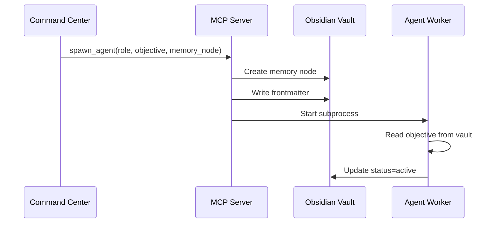

# Agent API

Agents are spawned as subprocess workers that communicate through the Obsidian Vault. This document describes the agent lifecycle, available roles, and communication protocol.

## Agent Roles

### UI Explorer

**Role ID**: `ui_explorer`

Specializes in browser automation and UI testing using Playwright.

**Capabilities:**
- Homepage structure testing
- Navigation link validation
- Contact form testing
- Accessibility audits (WCAG)
- Responsive design testing
- Screenshot capture
- Console error detection

**Worker Script**: `agents/ui_explorer/worker.py`

**Spawn Example:**
```json
{
  "role": "ui_explorer",
  "objective": "Test homepage at https://example.com",
  "memory_node": "Runs/Homepage_Test_20260115.md"
}
```

**Test Types:**

| Function | Description | Duration |
|----------|-------------|----------|
| `test_homepage()` | Page load, structure, console errors | ~30s |
| `test_navigation()` | Internal link validation | ~60s |
| `test_contact_form()` | Form discovery and validation | ~45s |
| `test_accessibility()` | WCAG compliance checks | ~40s |
| `test_responsive()` | Multi-viewport screenshots | ~50s |
| `test_full_suite()` | All tests sequentially | ~3min |

**Report Format:**
```markdown
# Test Report: Homepage

## Executive Summary
**Overall Status**: PASS

## Page Information
| Metric | Value |
|--------|-------|
| URL | https://example.com |
| Status | 200 |

## Navigation Audit
- Navigation elements found: 3

## Recommendations
1. Add meta description
```

### Data Validator

**Role ID**: `data_validator`

Specializes in API monitoring and data validation.

**Capabilities:**
- Network request interception
- API response validation
- Payload verification
- Header checking
- Error detection

**Worker Script**: `agents/data_validator/worker.py`

**Spawn Example:**
```json
{
  "role": "data_validator",
  "objective": "Monitor API calls on https://example.com",
  "memory_node": "Runs/API_Test_20260115.md"
}
```

**Test Types:**

| Function | Description | Duration |
|----------|-------------|----------|
| `monitor_api_calls()` | General API monitoring | ~60s |
| `validate_api_endpoint()` | Specific endpoint validation | ~30s |

**Report Format:**
```markdown
# API Monitoring Report

## Requests Intercepted
| Type | Count |
|------|-------|
| API | 15 |
| Static | 23 |

## Errors Found
- POST /api/contact: 500 Server Error
```

## Agent Lifecycle

### 1. Spawn



### 2. Execution

```python
async def run_agent(agent_id, memory_node):
    # Read objective
    node = vault.read_node(memory_node)
    objective = node["frontmatter"]["objective"]
    
    # Extract URL
    url = extract_url(objective)
    
    # Start browser
    browser = BrowserAutomation()
    await browser.start()
    
    # Determine test type
    if "navigation" in objective.lower():
        await test_navigation(browser, url, agent_id, memory_node)
    elif "contact" in objective.lower():
        await test_contact_form(browser, url, agent_id, memory_node)
    # ... etc
```

### 3. Progress Updates

Agents update progress continuously:

```python
await update_progress(
    agent_id=agent_id,
    memory_node=memory_node,
    step="Checking page structure",
    progress=50,
    findings="- Navigation elements: 3"
)
```

This writes to the vault:
```yaml
---
status: active
progress_percent: 50
last_action: "Checking page structure"
---

## [10:30:15] Checking page structure
- Navigation elements: 3
```

### 4. Completion

```python
vault.update_frontmatter(memory_node, {
    "status": "completed",
    "result": "pass",
    "progress_percent": 100,
    "end_time": "2026-01-15T10:35:00Z"
})
```

### 5. Termination

Agent process exits automatically. MCP Server detects exit and updates status if needed.

## Communication Protocol

### Agent → Vault

Agents write to their memory node:

```python
# Update status
vault.update_frontmatter(node, updates)

# Append findings
node = vault.read_node(node_path)
new_content = node["content"] + "\n## Finding\nDetails..."
vault.write_node(node_path, new_content, node["frontmatter"])
```

### Vault → Dashboard

```
Agent writes to vault
    ↓
VaultWatcher detects file change
    ↓
ObsidianReader parses update
    ↓
Command Center receives update
    ↓
SSE broadcasts to browser
    ↓
Dashboard UI updates
```

### Latency: ~160ms end-to-end

## Environment Variables

Agents receive these environment variables on spawn:

| Variable | Description |
|----------|-------------|
| `AGENT_ID` | Unique agent identifier |
| `AGENT_ROLE` | Agent role (ui_explorer, data_validator) |
| `AGENT_OBJECTIVE` | Mission description |
| `AGENT_MEMORY_NODE` | Path to memory node |
| `PYTHONPATH` | Python path (/app) |
| `HEADLESS` | Browser headless mode |

## Creating Custom Agents

To add a new agent role:

1. **Create worker script**:
```python
# agents/my_agent/worker.py
async def run_agent(agent_id, memory_node):
    # Read objective
    # Execute tests
    # Update vault
    pass
```

2. **Add to spawner**:
```python
# mcp_server/tools.py
worker_scripts = {
    "ui_explorer": "agents/ui_explorer/worker.py",
    "data_validator": "agents/data_validator/worker.py",
    "my_agent": "agents/my_agent/worker.py"
}
```

3. **Update chatbot**:
```python
# command_center/chatbot.py
TEST_TYPES = {
    "my_test": {
        "name": "My Test",
        "role": "my_agent",
        "keywords": ["my", "custom"]
    }
}
```

4. **Create soul file**:
```markdown
# My Agent Soul

## Personality
Describe the agent's behavior

## Capabilities
- What tests can it run?
- What tools does it use?

## Constraints
- Resource limits
- Timeout settings
```

## Agent Persona (Soul)

Each agent has a "soul" — a behavioral DNA file:

```markdown
# UI Explorer Soul

## Personality
Meticulous, obsessive frontend specialist. 
Treats every pixel as a potential bug.

## Testing Philosophy
- Visual consistency is non-negotiable
- Accessibility is a right, not a feature
- Mobile-first means testing mobile first

## Decision Making
When encountering ambiguity:
1. Take screenshot
2. Log finding
3. Continue testing
4. Report all findings
```

The soul influences:
- How agents prioritize tests
- What they consider important
- How they report findings
- Error handling behavior

## Monitoring

### Agent Logs
```bash
# View worker log
cat obsidian_vault/Runs/ui_explorer-20260115-120000-abc123_worker.log

# Follow log in real-time
tail -f obsidian_vault/Runs/*_worker.log
```

### Process Status
```bash
# List agent processes
ps aux | grep "agents/"

# Check specific agent
pgrep -f "ui_explorer-20260115"
```

### Resource Usage
```bash
# Memory usage
ps -o pid,ppid,%mem,%cpu,cmd -p $(pgrep -f "ui_explorer")
```