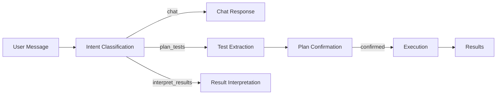
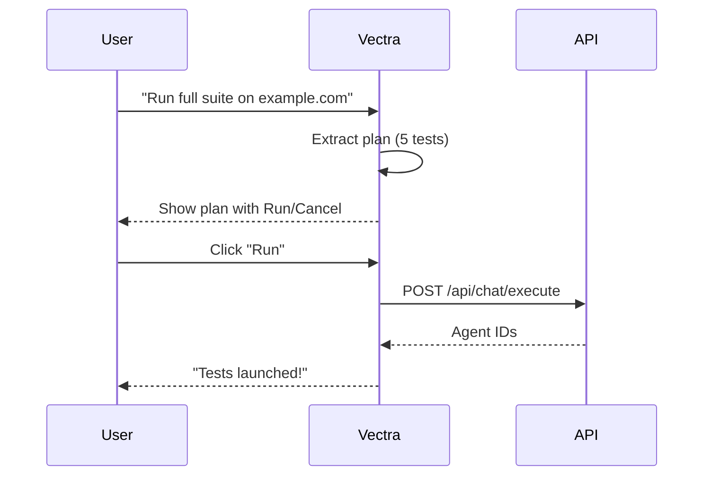

# Chatbot API

Vectra provides a conversational interface for configuring and running tests through natural language.

## Overview

The chatbot uses a multi-step processing pipeline:



## Intent Classification

The chatbot classifies user messages into three categories:

| Intent | Description | Example |
|--------|-------------|---------|
| `chat` | General conversation | "What can you do?" |
| `plan_tests` | User wants to run tests | "Test the contact form" |
| `interpret_results` | User wants to understand results | "What did the last test find?" |

Classification uses both LLM reasoning and keyword fallback:

```python
# LLM classification
intent = llm.complete("Classify: chat, plan_tests, or interpret_results")

# Fallback keywords
if "test" in message or "check" in message:
    intent = "plan_tests"
```

## Test Plan Extraction

When intent is `plan_tests`, the chatbot extracts:

### URL Extraction
Uses regex to find URLs in the message:
```python
url_pattern = r'https?://[^\s<>"{}|\\^`\[\]]+'
```

### Test Type Determination

**Method 1: Keyword matching**
```python
test_keywords = {
    "contact": ["contact", "form", "email"],
    "navigation": ["nav", "links", "menu"],
    "accessibility": ["a11y", "aria", "screen reader"]
}
```

**Method 2: LLM reasoning** (fallback)
```python
prompt = """Given this request, which tests are appropriate?
Options: homepage, navigation, contact, api, accessibility, responsive, full
Request: {message}
"""
```

### Plan Structure

```json
{
  "url": "https://example.com",
  "tests": ["contact", "navigation"],
  "test_configs": [
    {
      "name": "Contact Form",
      "description": "Form fields, validation, accessibility",
      "role": "ui_explorer"
    }
  ]
}
```

## Conversation Flow

### Example 1: Simple Test

**User**: "Test the homepage of example.com"

**Vectra**: "I'll run a homepage test on https://example.com. This will check page structure, navigation, CTAs, and console errors. Does this look correct? Say **yes** to proceed."

**User**: *clicks "Run" or types "yes"*

**Vectra**: "✅ Test launched! Agent `ui_explorer-...` is now testing. I'll let you know when it's done."

### Example 2: Complex Plan

**User**: "Check navigation and mobile layout on https://example.com"

**Vectra**: "I'll run two tests:

1. **Navigation** — Link validation, page transitions
2. **Responsive Design** — Desktop, tablet, mobile viewports

On https://example.com. Does this look correct?"

### Example 3: Result Interpretation

**User**: "What did the last test find?"

**Vectra**: "The most recent test found:

**Critical**: ❌ Contact form missing email validation
**Warning**: ⚠️ 3 images missing alt text
**Good**: ✅ HTTPS enabled, no console errors

**Fix for email validation:**
```html
<input type="email" required>
```

Would you like me to run a detailed contact form test?"

## Confirmation Flow

For multi-test plans, the chatbot requires explicit confirmation:



Simple single-test requests execute immediately without confirmation.

## Result Interpretation

The chatbot can analyze test results and provide:

### Executive Summary
Plain English overview of test status.

### Critical Issues
High-severity findings requiring immediate attention.

### Actionable Recommendations
Specific fixes with code examples:
```markdown
**Fix for missing alt text:**
```html

```

### Follow-Up Suggestions
Recommended additional tests based on findings.

## Context Management

The chatbot maintains conversation context:

### Message History
- Last 20 messages loaded for context
- Full history stored in `Global/Chat_Log.md`
- History survives page refreshes

### Cross-Test Memory
Vectra remembers:
- Recently tested URLs
- Previously discussed issues
- User preferences (e.g., always check accessibility)

### Context Window
```python
MAX_HISTORY_MESSAGES = 50  # Total messages in vault
CONTEXT_WINDOW = 10        # Messages sent to LLM
```

## Streaming Responses

For long responses, the chatbot supports SSE streaming:

```javascript
const eventSource = new EventSource('/api/chat/sse?message=...');

eventSource.onmessage = (event) => {
    const data = JSON.parse(event.data);
    if (data.chunk) {
        appendText(data.chunk);  // Append token
    }
    if (data.done) {
        eventSource.close();
    }
};
```

## Error Handling

### Invalid URL
**User**: "Test the homepage"
**Vectra**: "I'd be happy to run tests! Could you provide the URL you'd like me to test?"

### Unsupported Test Type
**User**: "Test the database on example.com"
**Vectra**: "I don't currently support database testing. I can help with:
- Homepage tests
- Navigation tests
- Contact form tests
- API monitoring
- Accessibility audits
- Responsive design tests"

### LLM Failure
**User**: "Run a test"
**Vectra**: "I apologize, but I'm having trouble processing your request right now. Please try again or use the test launcher form."

## Configuration

### Model Selection
```bash
CHATBOT_MODEL=anthropic/claude-3-5-sonnet-20241022
```

Supported providers:
- `anthropic/claude-3-5-sonnet-20241022`
- `openai/gpt-4o`
- `openai/gpt-4o-mini`
- `google/gemini-1.5-pro`
- `minimax/minimax-text-01`
- `kimi/kimi-k2`
- `local/llama3.1:70b`

### History Limits
```bash
CHATBOT_MAX_HISTORY=50  # Messages to retain
```

### Streaming
```bash
CHATBOT_ENABLE_STREAMING=true
```

## Implementation Details

### Backend (`command_center/chatbot.py`)

```python
class ChatEngine:
    def classify_intent(self, message):
        # Returns: "chat", "plan_tests", or "interpret_results"
        
    def extract_test_plan(self, message):
        # Returns: {"url": "...", "tests": [...]}
        
    def generate_response(self, message, history):
        # Returns conversational response
        
    def interpret_results(self, agent_id, result_data):
        # Returns LLM-interpreted summary
```

### Frontend (Dashboard)

The chat widget is a floating panel in the bottom-right corner:
- Collapsed: Shows header bar with 🤖 Vectra + unread badge
- Expanded: Full chat interface with messages and input
- Auto-expands when receiving new messages

## Best Practices

### For Users
- **Be specific**: "Test the contact form on https://example.com" > "Run a test"
- **Mention URLs**: Always include the target URL
- **Use keywords**: "navigation", "contact", "accessibility" help Vectra understand intent
- **Confirm plans**: Review multi-test plans before confirming

### For Developers
- **Add new test types**: Update `TEST_TYPES` dict in `chatbot.py`
- **Customize persona**: Modify `system_prompt` in `ChatEngine`
- **Extend intent classification**: Add new intents and handlers