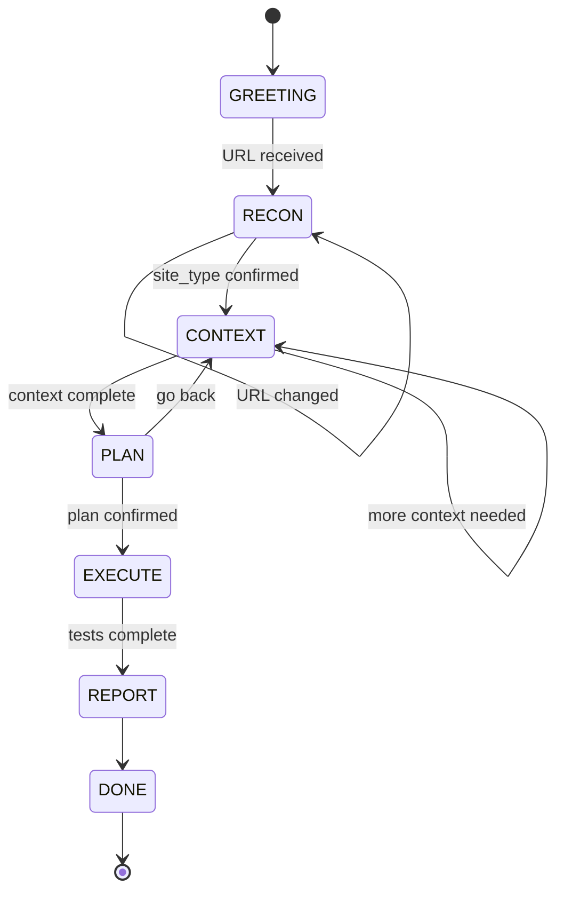

# Live QA Engineer — Staged, Conversational, Site-Type-Aware Intake

The Live QA Engineer is the persona you talk to from the dashboard chat
panel. Instead of writing test scenarios by hand, you have a conversation
with Vectra. The engineer introduces itself, asks which site to test,
classifies the site type, gathers context, proposes a test plan, runs
the plan with live narration, and delivers a plain-English report.

Every interaction is emitted as a structured `EngineerEvent` over HTTP
and Server-Sent Events, so the dashboard can render each step with the
right component and the right level of urgency.

For the wire-level HTTP and SSE contract, see
[endpoints.md](endpoints.md#live-qa-engineer).

## The 6-stage flow

The engineer walks the user through seven logical stages. Six are
visible to the user (`GREETING` is the entry point), and `DONE` is the
terminal state.

```
   ┌──────────┐   ┌────────┐   ┌─────────┐   ┌──────┐   ┌─────────┐   ┌────────┐   ┌──────┐
   │ GREETING │ → │ RECON  │ → │ CONTEXT │ → │ PLAN │ → │ EXECUTE │ → │ REPORT │ → │ DONE │
   └──────────┘   └────────┘   └─────────┘   └──────┘   └─────────┘   └────────┘   └──────┘
        │              │            │             │            │              │
        │ 1. Hi + ask │ 2. Fetch   │ 3. Plain-   │ 4. Show    │ 5. Narrate │ 6. Plain-
        │   for URL   │   URL +    │   English   │   test     │   per      │   English
        │             │   classify │   context   │   list +   │   test +   │   report
        │             │            │             │   Run      │   progress │   + done
        │             │            │             │            │              │
        ▼             ▼            ▼             ▼            ▼              ▼
   GreetingEvent  ClassifySite/  AskQuestion/  PlanProposed  TestStarted/  ReportEvent
                  ConfirmClass   AskCredential  + Ask        TestProgress  + DoneEvent
                                (if needed)    Question      /TestCompleted
```

| # | Stage | Purpose | Key event(s) |
|---|-------|---------|--------------|
| 1 | `greeting` | Introduce the persona, ask for the URL. | `GreetingEvent` |
| 2 | `recon` | Fetch the URL, classify the site, ask the user to confirm. | `ClassifySiteEvent`, `ConfirmClassificationEvent`, `AskQuestionEvent` |
| 3 | `context` | Ask plain-English questions about audience, critical flows, devices. Prompt for credentials **only** when the site type requires them. | `AskQuestionEvent`, `AskCredentialEvent` |
| 4 | `plan` | Show the proposed test list for the classified site. Wait for the user to confirm or change. | `PlanProposedEvent`, `AskQuestionEvent` |
| 5 | `execute` | Run each test in order. Emit a `TestStartedEvent`, narrate progress, emit a `TestCompletedEvent`. | `TestStartedEvent`, `NarrateEvent`, `TestProgressEvent`, `TestCompletedEvent` |
| 6 | `report` | Aggregate findings, render the 5-section plain-English report, mark the session done. | `ReportEvent`, `DoneEvent` |
| — | `done` | Terminal state. No more events. | `DoneEvent` |

## Structured event reference

The conversation is a discriminated union over the `type` field. All
events share the same envelope:

```python
class BaseEngineerEvent(BaseModel):
    session_id: str            # opaque session id
    stage:     Stage           # one of the 7 stages above
    timestamp: str             # ISO-8601 UTC
```

The thirteen concrete event types are:

### `GreetingEvent`

The engineer's opening line. Always the first event in a fresh session.

| Field | Type | Notes |
|-------|------|-------|
| `type` | `Literal["greeting"]` | discriminator |
| `message` | `str` | greeting text shown to the user |

### `AskQuestionEvent`

Open-ended clarifying question. Optional multiple-choice list.

| Field | Type | Notes |
|-------|------|-------|
| `type` | `Literal["ask_question"]` | discriminator |
| `question_id` | `str` | stable id for the question (e.g. `"url"`, `"context"`, `"plan"`) |
| `prompt` | `str` | question shown to the user |
| `choices` | `List[str] \| None` | when present, render as a button row |

### `AskCredentialEvent`

Prompt the user for a single credential field. Only ever emitted when
the classified `site_type` is in `CREDENTIAL_REQUIRED`.

| Field | Type | Notes |
|-------|------|-------|
| `type` | `Literal["ask_credential"]` | discriminator |
| `field` | `Literal["username", "password"]` | which field to collect |
| `reason` | `str` | why the field is needed (e.g. `"Sign-in requires a test account"`) |

The user submits the value back through `POST /api/engineer/{sid}/message`
with `body.credential = { "field": "...", "value": "..." }`. The value
is held in memory only.

### `ClassifySiteEvent`

Engineer's best guess of the target site type, with the signals that
drove the call.

| Field | Type | Notes |
|-------|------|-------|
| `type` | `Literal["classify_site"]` | discriminator |
| `site_type` | `str` | one of `"landing"`, `"ecommerce"`, `"blog"`, `"saas_app"`, `"portal"`, or `"unknown"` |
| `confidence` | `float` (0.0–1.0) | heuristic + LLM merge |
| `signals` | `List[str]` | e.g. `["add-to-cart button", "price-... class", "10 product links"]` |

### `ConfirmClassificationEvent`

Asks the user to confirm or correct the proposed site type.

| Field | Type | Notes |
|-------|------|-------|
| `type` | `Literal["confirm_classification"]` | discriminator |

### `PlanProposedEvent`

The full proposed test plan, keyed by site type.

| Field | Type | Notes |
|-------|------|-------|
| `type` | `Literal["plan_proposed"]` | discriminator |
| `tests` | `List[str]` | test ids from the `TEST_CATALOG` (e.g. `["homepage", "cart_flow", "auth_login"]`) |
| `site_type` | `str` | the classified site type this plan is for |

### `NarrateEvent`

Free-form status narration from an agent during execution. Used to
translate technical agent progress into plain English.

| Field | Type | Notes |
|-------|------|-------|
| `type` | `Literal["narrate"]` | discriminator |
| `agent_id` | `str` | which agent is narrating |
| `status` | `str` | `"running"`, `"waiting"`, `"done"`, etc. |
| `message` | `str` | plain-English sentence (≤ 15 words) |

### `TestStartedEvent`

Marks the start of a specific test in the plan.

| Field | Type | Notes |
|-------|------|-------|
| `type` | `Literal["test_started"]` | discriminator |
| `test_id` | `str` | name of the test (matches the `PlanProposedEvent.tests` entry) |
| `role` | `str` | agent role that will run the test (`"ui_explorer"`, `"auth_tester"`, ...) |

### `TestProgressEvent`

Incremental progress update for a test in flight.

| Field | Type | Notes |
|-------|------|-------|
| `type` | `Literal["test_progress"]` | discriminator |
| `test_id` | `str` | which test |
| `progress_percent` | `int` (0–100) | strict bounds enforced by Pydantic |
| `message` | `str` | short status sentence |

### `TestCompletedEvent`

Terminal event for a single test. Final result plus a one-sentence
findings summary.

| Field | Type | Notes |
|-------|------|-------|
| `type` | `Literal["test_completed"]` | discriminator |
| `test_id` | `str` | which test |
| `result` | `str` | `"pass"`, `"fail"`, `"warning"`, `"skip"` |
| `findings_summary` | `str` | one-sentence plain-English summary |

### `ReportEvent`

Aggregated report ready for display. The `sections` map has the five
fixed keys from `REPORT_TEMPLATE` (see [Forbidden vocabulary](#forbidden-vocabulary)).

| Field | Type | Notes |
|-------|------|-------|
| `type` | `Literal["report"]` | discriminator |
| `sections` | `Dict[str, Any]` | keys: `"Summary"`, `"What Works"`, `"What Needs Attention"`, `"Recommendations"`, `"Next Steps"` |

### `DoneEvent`

Stream finished. The engineer has no more events for this session.

| Field | Type | Notes |
|-------|------|-------|
| `type` | `Literal["done"]` | discriminator |

### `ErrorEvent`

Surfaces an error from anywhere in the engineer pipeline. The
dashboard renders this with an alert style.

| Field | Type | Notes |
|-------|------|-------|
| `type` | `Literal["error"]` | discriminator |
| `code` | `str` | machine-readable error code (e.g. `"session_not_found"`) |
| `message` | `str` | human-readable explanation |

## State machine

The stage progression is a deliberate state machine, not an LLM
decision. The LLM may emit free-form event content, but the code
decides which stage the conversation is in and when it transitions.



Three rules govern the transitions:

1. **Forward skip is rejected.** A session may advance by exactly one
   stage at a time. `GREETING → EXECUTE` raises.
2. **Backward moves need a "go back" keyword.** The keyword is the
   only way to move to a lower stage; it is forwarded through
   `assert_monotonic` as `go_back_keyword`.
3. **Same-stage self-transitions are always allowed.** Re-asking or
   re-confirmation does not advance the state.

The same site type may be re-classified (`RECON → RECON`) when the
URL changes mid-conversation. See
`command_center/engineer/state_machine.py` for the static
`ALLOWED_TRANSITIONS` map and the `assert_monotonic` guard.

## Site-type → test catalog matrix

The engineer recognises five site archetypes. Each one maps to a fixed,
ordered list of tests drawn from `TEST_CATALOG`.

| Site type | Description | Tests (in order) | Credentials? |
|-----------|-------------|------------------|:---:|
| `landing` | Single-page marketing site. No login, no transactions. | `homepage` → `accessibility` → `responsive` | no |
| `ecommerce` | Online store. Browse, search, cart, checkout, login. | `homepage` → `navigation` → `product_search` → `cart_flow` → `checkout_flow` → `auth_login` → `responsive` → `accessibility` | yes |
| `blog` | Content site with articles, categories, related links. Reader-only. | `homepage` → `navigation` → `content_links` → `responsive` → `accessibility` | no |
| `saas_app` | Logged-in web app with a dashboard and core feature flows. | `auth_login` → `dashboard_load` → `navigation` → `core_feature_smoke` → `responsive` | yes |
| `portal` | Role-based portal with dashboards, data tables, gated sections. | `auth_login` → `dashboard_load` → `navigation` → `role_based_access` → `data_table_render` → `responsive` | yes |

Site types in `CREDENTIAL_REQUIRED` (`ecommerce`, `saas_app`, `portal`)
trigger an `AskCredentialEvent` during the `CONTEXT` stage. Landing
pages and blogs never need a login.

## Credential security contract

The Live QA Engineer has a strict credential contract. Every other
part of the system relies on these guarantees.

- **Prompt-and-forget.** The engineer prompts for a credential only
  when needed (`CONTEXT` stage + `site_type in CREDENTIAL_REQUIRED`).
  The user types the value into a masked `<input type="password">`.
- **In-session only.** The value is stored on
  `SessionState.credentials` for the lifetime of the session. The
  `CredentialHandler.submit_credential` method mutates memory only.
- **Never persisted.** The value is **never** written to the Obsidian
  vault node, **never** included in any `EngineerEvent`, **never**
  logged via structlog, **never** included in the agent objective,
  and **never** echoed back in the response. The structlog
  `credential_submitted` line intentionally omits the `value` field.
- **Cleared on demand.** `CredentialHandler.clear` overwrites the
  password with a random hex string before nulling the reference, so
  the raw secret cannot linger in Python's object free-list.
- **Side-channel injection.** Credentials reach the agent via
  `FeatureTesterWorker.set_pending_credentials`, called from
  `LiveEngineer._prepare_agent` immediately before each test starts.

The plan-mode tests assert the security contract from five vectors:
structlog records, vault node, agent objective, chat history re-load,
and the SSE event stream. See
`tests/unit/test_live_engineer.py::test_credential_never_leaks` for
the canonical regression test.

## Forbidden vocabulary

To keep user-facing copy approachable, the narrator and report builder
strip a closed set of technical jargon before showing anything to the
user. The full set lives in
`command_center/engineer/vocabulary.py` (`FORBIDDEN_WORDS`); the
plain-English substitutes live in the same module
(`VOCABULARY_GLOSSARY`).

Base (singular) forms:

| Forbidden | Plain-English substitute |
|-----------|--------------------------|
| `selector` | part of the page |
| `DOM` | the page content |
| `viewport` | the visible screen area |
| `breakpoint` | screen size threshold |
| `JWT` | login token |
| `payload` | data packet |
| `schema` | data shape |
| `XHR` | old-style web request |
| `fetch` | request to the server |
| `console error` | developer message about a problem |
| `404` | page not found error |
| `500` | server-side error |
| `status code` | response number from the server |
| `CSS` | styling rules |
| `HTML` | page markup |
| `click handler` | the action triggered when something is clicked |
| `event listener` | background watcher for user actions |
| `cookie` | small browser tracker |
| `session ID` | login identifier |

Plural / variant forms (12 entries, all detected by the same
substring check):

`selectors`, `viewports`, `breakpoints`, `payloads`, `schemas`,
`fetches`, `console errors`, `status codes`, `click handlers`,
`event listeners`, `cookies`, `session IDs`.

That makes **31 forbidden words in total** (19 base + 12 plural).
`scrub_forbidden(text)` returns the list of offenders it found so the
caller can decide whether to retry, reject, or warn. Substituting
silently would hide the LLM's mistake.

## Structured event JSON schema

The full event schema is a Pydantic v2 discriminated union over the
`type` field. The wire shape is exactly `model_dump(mode="json")` of
the matched class. The shared envelope plus the per-event fields are:

```jsonc
{
  // shared envelope (BaseEngineerEvent)
  "session_id": "eng-20260603-abc123",   // str
  "stage":      "greeting",              // Stage enum: greeting|recon|context|plan|execute|report|done
  "timestamp":  "2026-06-03T12:00:00+00:00",  // ISO-8601 UTC

  // discriminator + per-event fields
  "type":     "ask_question",            // Literal string
  // (other fields depend on `type` — see the per-event tables above)

  // engine config
  "model_config": { "extra": "forbid" }  // unknown keys raise ValidationError
}
```

Validation guarantees:

- `extra="forbid"` is set on every model, so an unknown field surfaces
  as `pydantic.ValidationError` rather than silently propagating.
- The Stage enum is `str, Enum`, so `model_dump(mode="json")` writes
  the string value (e.g. `"greeting"`) without further translation.
- `progress_percent` is bounded `0 ≤ x ≤ 100` and rejected outside.
- The discriminated union is exposed as
  `EngineerEvent.model_validate({...})` and
  `EngineerEvent.model_validate_json('...')`, both returning the
  concrete event instance.

## Implementation map

The live QA engineer is split into small, testable modules under
`command_center/engineer/`:

| Module | Responsibility |
|--------|----------------|
| `events.py` | Pydantic v2 event schema, discriminated union |
| `state_machine.py` | Stage enum, `ALLOWED_TRANSITIONS`, `assert_monotonic` |
| `site_catalog.py` | `SITE_TYPES`, `TEST_CATALOG`, `CREDENTIAL_REQUIRED` |
| `vocabulary.py` | `FORBIDDEN_WORDS`, `VOCABULARY_GLOSSARY`, `scrub_forbidden` |
| `session.py` | `EngineerSession`, `EngineerSessionStore` |
| `credentials.py` | `CredentialHandler`, `scrub_log_record` |
| `classifier.py` | `SiteClassifier` (heuristic + LLM) |
| `conversation.py` | `ConversationEngine` (LLM-driven turns + deterministic helpers) |
| `narrator.py` | `Narrator` (plain-English SSE translation) |
| `report.py` | `ReportBuilder` (5-section plain-English report) |
| `metrics.py` | `MetricsRecorder` (per-session latency + breaches) |

The top-level orchestrator that wires all of these together is
`command_center/live_engineer.py` (`LiveEngineer` class). It exposes
`start_session`, `handle_message`, `resume_session`, and
`get_metrics` — the four methods the FastAPI layer (`command_center/main.py`)
calls to serve the `/api/engineer/*` endpoints.
