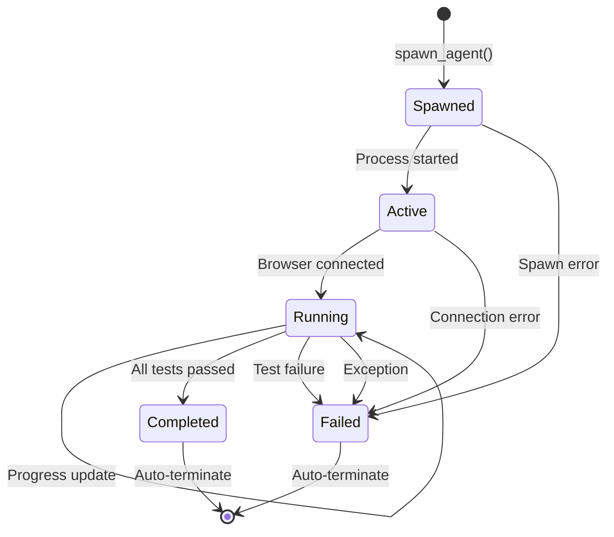

# Agent Communication Protocol

Vectra QA uses an **Agent-to-Agent (A2A)** communication protocol based on the Obsidian Vault. Unlike traditional message queues or HTTP APIs, agents communicate by reading and writing Markdown files.

## Why File-Based Communication?

### 1. Decoupling
Agents don't know about each other. They only know about the vault:
- **No direct dependencies** — Agent A doesn't import Agent B
- **No network failures** — Communication is local filesystem I/O
- **No service discovery** — Agents don't need to find each other

### 2. Persistence
Every message is automatically saved:
- **Crash recovery** — If an agent crashes, its state is in the vault
- **Audit trail** — Complete history of all communication
- **Replay capability** — Re-run tests from saved state

### 3. Observability
Humans can read agent conversations:
```bash
cat obsidian_vault/Runs/Test_20260115.md
```

## Communication Patterns

### Pattern 1: Status Updates

Agent writes progress to its own node:

```python
# Worker process
vault.update_frontmatter(memory_node, {
    "status": "active",
    "progress_percent": 50,
    "last_action": "Checking navigation links"
})
```

Command Center reads and broadcasts:
```python
# Dashboard reads via obsidian_reader
agent = reader.get_active_agents()[0]
# Returns: {"progress_percent": 50, "last_action": "..."}
```

### Pattern 2: Findings Reports

Agent appends findings to node content:

```python
findings = """
## [10:30:15] Navigation Check Complete

- **Links found**: 15
- **Broken links**: 2
- **Details**:
  - /about — 404 Not Found
  - /contact — 500 Server Error
"""

node = vault.read_node(memory_node)
new_content = node["content"] + findings
vault.write_node(memory_node, new_content, node["frontmatter"])
```

### Pattern 3: Inter-Agent Coordination

Agents reference each other's work:

```markdown
# Agent B's Report

## Cross-Reference
The UI Explorer found 2 broken links.
See: [[Navigation_Test_20260115]]

## API Validation
I verified the /api/contact endpoint:
- Returns 500 when the form is submitted
- This confirms the UI Explorer's finding
```

## Message Format

### Standard Message Structure

```markdown
## [ISO_TIMESTAMP] ACTION_NAME

### Context
Relevant background information

### Data
- **Key**: Value
- **Key**: Value

### Decisions
What the agent decided to do

### Next Steps
What should happen next
```

### Example: Test Completion

```markdown
## [2026-01-15T10:35:00Z] Test Complete

### Summary
All homepage checks passed successfully.

### Metrics
| Metric | Value |
|--------|-------|
| Page Load | 1.2s |
| Links | 15 |
| Errors | 0 |

### Screenshots
- [[Screenshots/homepage_20260115.png]]

### Recommendations
1. Consider adding meta description
2. Optimize image sizes
```

## Synchronization

### The Vault Watcher

```python
class VaultWatcher(FileSystemEventHandler):
    def on_modified(self, event):
        if event.src_path.endswith('.md'):
            rel_path = os.path.relpath(event.src_path, VAULT_PATH)
            self._notify_change(rel_path)
```

### Notification Chain

```
File Modified
    ↓
VaultWatcher detects change
    ↓
ObsidianReader parses file
    ↓
Command Center receives update
    ↓
SSE broadcasts to browser
    ↓
Dashboard UI updates
```

### Latency

| Operation | Latency |
|-----------|---------|
| File write | ~1ms |
| Watchdog detection | ~10ms |
| Parse and broadcast | ~50ms |
| SSE to browser | ~100ms |
| **Total** | **~160ms** |

## State Machine

### Agent Lifecycle States



### State Transitions

| From | To | Trigger | Vault Update |
|------|-----|---------|--------------|
| None | Spawned | `spawn_agent()` | Create node |
| Spawned | Active | Process starts | `status=active` |
| Active | Running | Browser connects | `status=running` |
| Running | Running | Progress | `progress_percent` |
| Running | Completed | Tests done | `status=completed, result=pass` |
| Running | Failed | Error | `status=failed, error=...` |

## Error Handling

### Agent Crash Recovery

If an agent process crashes:

1. **Process monitor** detects exit
2. **MCP Server** updates node status:
   ```yaml
   status: failed
   error: "Process exited with code 1"
   ```
3. **Command Center** broadcasts failure
4. **Dashboard** shows red status badge

### Network Timeouts

If browser automation times out:

```python
try:
    await browser.visit(url, timeout=30)
except TimeoutError:
    vault.update_frontmatter(memory_node, {
        "status": "failed",
        "error": "Page load timeout after 30s"
    })
```

### Partial Failures

Some tests pass, some fail:

```yaml
---
status: completed
result: warning
sections_passed: 5
sections_failed: 2
---
```

## Best Practices

### 1. Atomic Updates
Update frontmatter in one operation:
```python
# Good
vault.update_frontmatter(node, {
    "status": "completed",
    "result": "pass",
    "progress_percent": 100
})

# Bad (multiple writes)
vault.update_frontmatter(node, {"status": "completed"})
vault.update_frontmatter(node, {"result": "pass"})
```

### 2. Idempotent Messages
Agents should handle duplicate reads:
```python
# Check if already processed
if node["frontmatter"].get("status") == "completed":
    return  # Skip
```

### 3. Graceful Degradation
If vault is unavailable:
```python
try:
    vault.update_frontmatter(node, updates)
except FileNotFoundError:
    # Log to stdout as fallback
    print(f"[ERROR] Could not write to {node}")
```

### 4. Content Size Limits
Keep messages concise:
- **Frontmatter**: < 1KB (structured data only)
- **Content**: < 100KB (use screenshots for visual data)
- **Screenshots**: Store paths, not base64

## Comparison with Traditional Protocols

| Feature | Vault A2A | HTTP REST | gRPC | Message Queue |
|---------|-----------|-----------|------|---------------|
| **Coupling** | Loose | Tight | Tight | Loose |
| **Persistence** | Built-in | Manual | Manual | Configurable |
| **Observability** | Human-readable | Binary | Binary | Protocol-dependent |
| **Ordering** | Timestamp | Request/response | Stream | FIFO |
| **Retries** | Manual | HTTP codes | Built-in | Built-in |
| **Overhead** | None | HTTP headers | Protobuf | Queue overhead |

**Use Case Fit**: For testing frameworks where observability and simplicity matter more than raw performance.