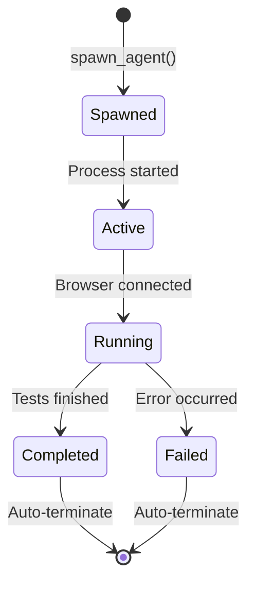
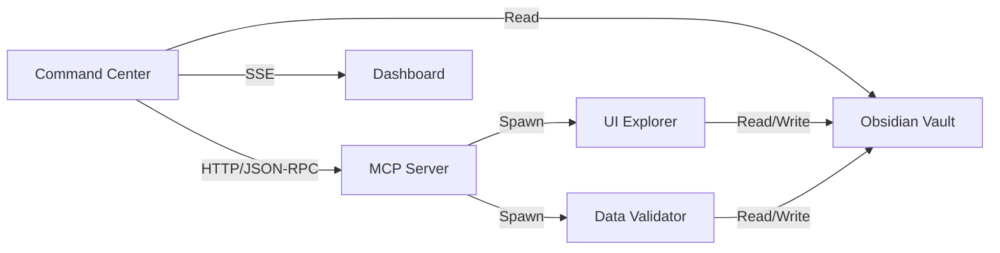

# System Components

Vectra QA consists of four main components that work together to provide autonomous testing capabilities.

## 1. Command Center

The user-facing web application and API server.

### Responsibilities
- Serve the dark-mode dashboard (HTMX frontend)
- Handle API requests for test execution
- Stream real-time updates via Server-Sent Events
- Manage chatbot conversations
- Parse and present test results

### Key Files
- `command_center/main.py` — FastAPI application with all endpoints
- `command_center/obsidian_reader.py` — Vault file watcher and parser
- `command_center/chatbot.py` — Conversational AI engine
- `command_center/static/index.html` — Dashboard UI
- `command_center/static/result.html` — Test result page

### API Endpoints

| Method | Endpoint | Description |
|--------|----------|-------------|
| GET | `/` | Dashboard HTML |
| POST | `/api/tests/run` | Launch a test |
| GET | `/api/agents/active` | List active agents |
| GET | `/api/results` | List all test results |
| GET | `/api/results/{agent_id}` | Get specific result |
| POST | `/api/chat/message` | Send chat message |
| GET | `/api/sse/stream` | Main SSE stream |
| GET | `/api/sse/results/{agent_id}` | Agent-specific SSE |

## 2. MCP Server

The Model Context Protocol tool server that exposes operations for agent management.

### Responsibilities
- Expose tools via JSON-RPC over HTTP
- Spawn and terminate agent processes
- Manage the tool registry
- Provide vault operations (read/write nodes)

### Key Files
- `mcp_server/server.py` — MCP protocol server
- `mcp_server/tools.py` — Tool definitions and agent spawner
- `mcp_server/llm_router.py` — Multi-provider LLM routing
- `mcp_server/browser_tools.py` — Playwright automation wrapper

### Available Tools

| Tool | Description |
|------|-------------|
| `spawn_agent` | Start a new agent worker |
| `terminate_agent` | Stop an agent process |
| `read_obsidian_node` | Read vault node content |
| `write_obsidian_node` | Write vault node |
| `update_frontmatter` | Update node metadata |

## 3. Agent Workers

Specialized processes that perform actual testing work.

### UI Explorer Agent
- **Role**: `ui_explorer`
- **Purpose**: Browser automation and UI testing
- **Technologies**: Playwright, Python asyncio
- **Tests**: Homepage, navigation, contact forms, accessibility, responsive design
- **Reports**: Structured Markdown with findings and screenshots

### Data Validator Agent
- **Role**: `data_validator`
- **Purpose**: API monitoring and data validation
- **Technologies**: Playwright network interception
- **Tests**: API endpoint monitoring, response validation
- **Reports**: Request/response analysis

### Agent Lifecycle



## 4. Obsidian Vault

The shared memory layer using Markdown files.

### Directory Structure

```
obsidian_vault/
├── Templates/
│   └── Agent_Spawn_Template.md
├── Global/
│   ├── Test_Run_Master.md
│   ├── UI_State_Log.md
│   ├── Data_Validation_Log.md
│   └── Chat_Log.md
├── Runs/
│   ├── Homepage_Test_20260115.md
│   ├── Navigation_Test_20260115.md
│   └── ...
└── Screenshots/
    ├── agent-id_homepage.png
    └── ...
```

### Node Format

Every node is a Markdown file with YAML frontmatter:

```markdown
---
agent_role: ui_explorer
agent_id: ui_explorer-20260115-120000-abc123
status: completed
objective: Test homepage at https://example.com
spawned_at: 2026-01-15T12:00:00Z
progress_percent: 100
result: pass
screenshots:
  - obsidian_vault/Screenshots/agent-id_homepage.png
---

# Agent Log

## Objective
Test the homepage at https://example.com

## Progress
- [x] Page loaded
- [x] Navigation checked
- [x] Screenshots captured

## Findings
- **URL**: https://example.com
- **Title**: Example Domain
- **Console errors**: 0
```

### Memory Types

| Type | Location | Purpose |
|------|----------|---------|
| **Global State** | `Global/*.md` | System-wide status and logs |
| **Test Runs** | `Runs/*.md` | Individual test results |
| **Chat History** | `Global/Chat_Log.md` | Conversation persistence |
| **Screenshots** | `Screenshots/*.png` | Visual test evidence |
| **Templates** | `Templates/*.md` | Agent spawn templates |

## Component Interactions



## Communication Protocol

### A2A (Agent-to-Agent)

Agents communicate indirectly through the vault:

1. **Agent A** writes findings to `Runs/Test_A.md`
2. **Vault Watcher** detects file change
3. **Command Center** reads update via `obsidian_reader.py`
4. **Dashboard** receives SSE push
5. **Agent B** (if running) can read Agent A's results

This pattern ensures:
- **Decoupling**: Agents don't depend on each other
- **Persistence**: All state is durable (filesystem)
- **Observability**: Humans can read agent logs directly
- **Auditability**: Complete history is preserved

### Human-to-Agent

Users interact with agents through:

1. **Dashboard Form**: Direct test configuration
2. **Chat Interface**: Natural language requests to Vectra
3. **API Calls**: Programmatic test execution

All interactions ultimately result in:
- Vault node creation
- Agent process spawn
- Real-time progress updates
- Final result storage