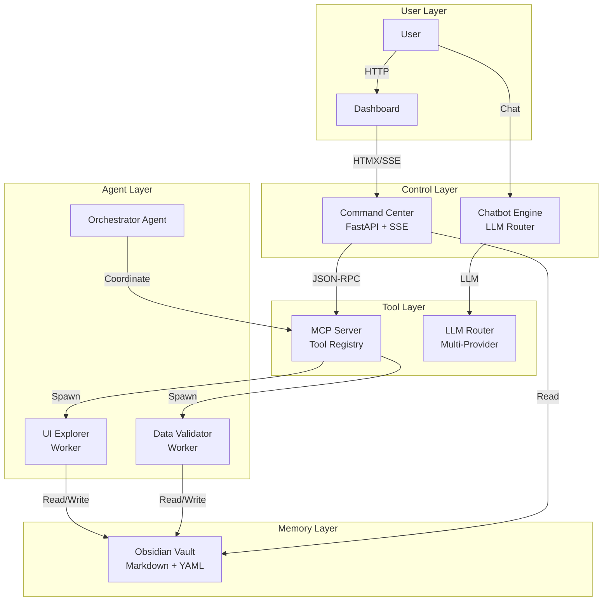
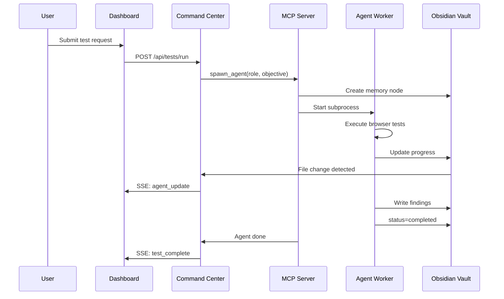
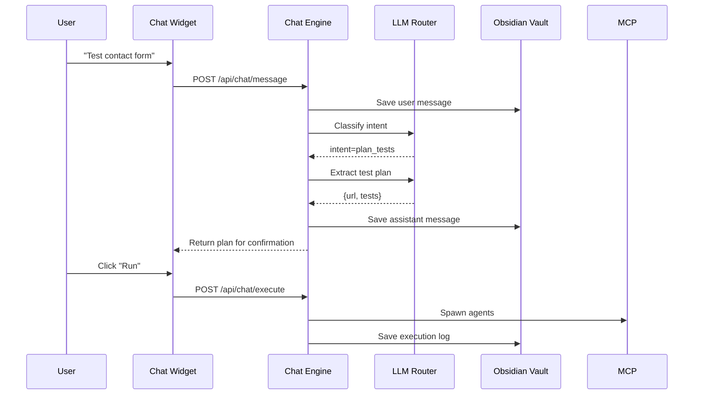

# Architecture Overview

Vectra QA follows a distributed multi-agent architecture where specialized agents collaborate to test web applications autonomously.

## High-Level Architecture

## Key Principles

### 1. Agent-Centric Design

Instead of writing test scripts, you **deploy agents** with objectives. Each agent:
- Has a unique behavioral DNA (persona)
- Maintains its own memory
- Communicates through the vault (not direct messaging)
- Auto-terminates after mission completion

### 2. Filesystem as Message Bus

Agents don't use HTTP APIs or message queues to communicate. They read/write **Markdown files** in the Obsidian Vault:
- **Frontmatter** (YAML) for structured state
- **Content** for findings and logs
- **Wiki-links** for semantic relationships

### 3. Real-Time Observation

The Command Center doesn't poll. It uses:
- **Watchdog** file system events → instant updates
- **Server-Sent Events** → push to browser
- **HTMX** → partial page updates without full reloads

## Component Breakdown

### Command Center
- **FastAPI** backend with async endpoints
- **HTMX** frontend for hypermedia-driven UI
- **SSE streams** for live data (agents, orchestrator, results)
- **Chatbot engine** with intent classification

### MCP Server
- **Tool registry** exposing spawn/read/write operations
- **Agent spawner** managing subprocess lifecycle
- **JSON-RPC** over HTTP for tool execution
- **SSE transport** for agent updates

### Agent Workers
- **UI Explorer**: Playwright-based browser automation
- **Data Validator**: Network interception and API validation
- **Orchestrator**: Mission planning and coordination (planned)

### Obsidian Vault
- **Global nodes**: System state, logs, chat history
- **Run nodes**: Individual test results
- **Templates**: Agent spawn templates
- **Screenshots**: Visual test evidence

## Data Flow

### Test Execution Flow

### Chat Flow

## Technology Stack

| Layer | Technology |
|-------|-----------|
| **Backend** | FastAPI, Python 3.11+ |
| **Frontend** | Vanilla HTML/CSS/JS, HTMX |
| **Real-Time** | Server-Sent Events |
| **Browser Automation** | Playwright |
| **Memory** | Obsidian Vault (Markdown + YAML) |
| **LLM Routing** | OpenAI, Anthropic, Google, MiniMax, Kimi, Local |
| **Container** | Docker, Docker Compose |
| **Documentation** | MkDocs Material |

## Resource Efficiency

Unlike traditional testing frameworks that keep browsers open indefinitely:

- **Agents spawn on-demand** — No idle processes
- **Auto-termination** — Workers exit after completion
- **Shared vault** — No database connections to maintain
- **Headless by default** — Minimal resource usage

## Scalability Considerations

Current architecture supports:
- **10+ concurrent agents** per MCP server
- **1000+ test runs** in vault (limited by filesystem)
- **Multiple LLM providers** with fallback

Future improvements:
- Agent pooling for faster startup
- Distributed vault (shared filesystem)
- Horizontal MCP server scaling