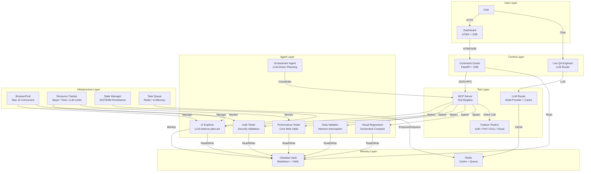
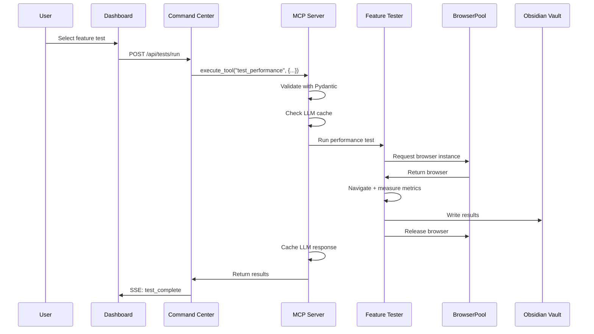
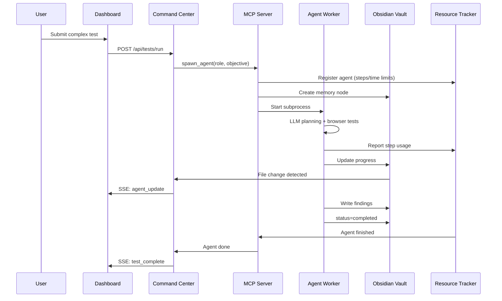
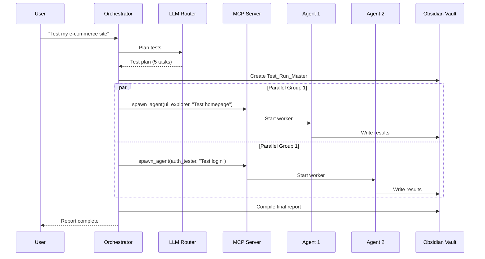
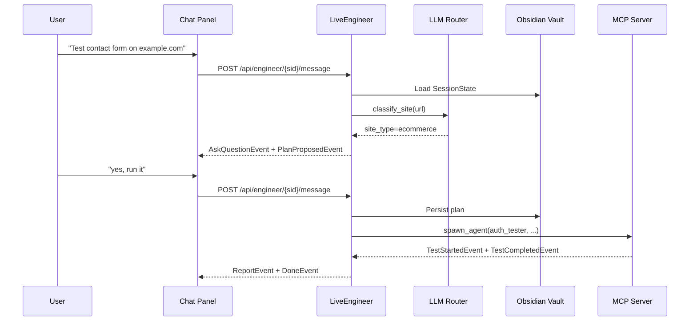

# Architecture Overview

Vectra QA follows a distributed multi-agent architecture where specialized agents collaborate to test web applications autonomously.

## High-Level Architecture

## Key Principles

### 1. Agent-Centric Design

Instead of writing test scripts, you **deploy agents** with objectives. Each agent:

- Has a unique behavioral DNA (persona from `soul.md` and `agents.md`)
- Maintains its own memory in the Obsidian Vault
- Communicates through the vault (not direct messaging)
- Auto-terminates after mission completion
- Uses LLM reasoning for every decision (no keyword matching)

### 2. Filesystem as Message Bus

Agents don't use HTTP APIs or message queues to communicate. They read/write **Markdown files** in the Obsidian Vault:

- **Frontmatter** (YAML) for structured state (status, metrics, timestamps)
- **Content** for findings and logs
- **Wiki-links** (`[[ ]]`) for semantic relationships between tests
- **File locking** prevents corruption during concurrent writes
- **Atomic writes** ensure no partial files on crash

### 3. Real-Time Observation

The Command Center doesn't poll. It uses:

- **Watchdog** file system events → instant updates
- **Server-Sent Events** → push to browser
- **HTMX** → partial page updates without full reloads

### 4. Production Reliability

- **Graceful Shutdown**: SIGTERM handlers persist agent state
- **Health Checks**: `/health`, `/ready`, `/metrics` endpoints
- **Resource Limits**: BrowserPool (max 10), AgentResourceTracker (steps/time/LLM limits)
- **Test Isolation**: Fresh browser contexts, cookie clearing between agents
- **State Backup**: Orphaned agents detected and marked on startup

## Component Breakdown

### Command Center

- **FastAPI** backend with async endpoints
- **HTMX** frontend for hypermedia-driven UI
- **SSE streams** for live data (agents, orchestrator, results)
- **Live QA Engineer** with 6-stage conversation and site-type classifier
- **Health endpoints**: `/health`, `/ready`, `/metrics`

### MCP Server

- **Tool registry** exposing 15+ tools (spawn, read/write, feature tests)
- **Agent spawner** managing subprocess lifecycle
- **Pydantic validation** for all tool inputs
- **Tenacity retry** logic with exponential backoff
- **Structured logging** with structlog
- **SSE transport** for agent updates

### Feature Testers (Direct Execution)

No agent spawning needed — execute directly via MCP tools:

- **`test_auth_flow`**: Login/logout with security validation
- **`test_performance`**: Core Web Vitals + Lighthouse CI
- **`test_accessibility`**: axe-core + manual WCAG checks
- **`test_visual_regression`**: Screenshot baseline comparison
- **`test_api_contract`**: OpenAPI schema validation
- **`test_multi_browser`**: Chromium/Firefox/WebKit smoke tests

### Agent Workers (LLM-Driven Exploration)

For complex scenarios requiring AI reasoning:

- **UI Explorer**: Playwright + LLM observe-plan-act loop
- **Data Validator**: Network interception and API validation
- **Auth Tester**: Security-focused authentication testing
- **Performance Tester**: Comprehensive performance audit
- **Accessibility Tester**: Deep accessibility analysis
- **Visual Regression Tester**: Visual consistency checks
- **API Contract Tester**: Schema compliance validation
- **Multi-Browser Tester**: Cross-browser compatibility
- **Orchestrator**: Mission planning and multi-agent coordination

### Infrastructure

- **BrowserPool**: Limits concurrent browser instances (max 10)
- **AgentResourceTracker**: Enforces step/time/LLM call limits per agent
- **StateManager**: Handles SIGTERM, persists state, restores on startup
- **TaskQueue**: Redis-backed or in-memory priority queue for distributed workers
- **LLMCache**: SHA256-based response cache with TTL and disk persistence

### Obsidian Vault

- **Global nodes**: System state, logs, chat history, agent state backups
- **Run nodes**: Individual test results with YAML frontmatter
- **Templates**: Agent spawn templates
- **Screenshots**: Visual test evidence
- **Baselines**: Visual regression baseline images

## Data Flow

### Feature Test Execution Flow

### Agent-Based Test Execution Flow

### Orchestrator Flow (Multi-Agent)

### Live QA Engineer Flow

## Technology Stack

| Layer | Technology |
|-------|-----------|
| **Backend** | FastAPI, Python 3.12+ |
| **Frontend** | Vanilla HTML/CSS/JS, HTMX |
| **Real-Time** | Server-Sent Events |
| **Browser Automation** | Playwright (Chromium, Firefox, WebKit) |
| **Memory** | Obsidian Vault (Markdown + YAML + File Locking) |
| **LLM Routing** | OpenAI, Anthropic, Google, MiniMax, Kimi, Local |
| **LLM Cache** | SHA256-based with TTL and disk persistence |
| **Task Queue** | Redis (distributed) or In-Memory (single-node) |
| **Validation** | Pydantic v2 |
| **Logging** | structlog |
| **Retry Logic** | tenacity |
| **Container** | Docker, Docker Compose |
| **Documentation** | MkDocs Material |
| **CI/CD** | GitHub Actions |

## Resource Efficiency

Unlike traditional testing frameworks that keep browsers open indefinitely:

- **Agents spawn on-demand** — No idle processes
- **Auto-termination** — Workers exit after completion
- **BrowserPool** — Limits concurrent browsers (max 10)
- **LLM Cache** — Reduces API costs by 60-80%
- **Shared vault** — No database connections to maintain
- **Headless by default** — Minimal resource usage
- **Test isolation** — Fresh contexts, cleared cookies between agents

## Scalability

Current architecture supports:

- **10+ concurrent agents** per MCP server (configurable)
- **Distributed workers** via Redis task queue
- **Horizontal scaling** — Multiple MCP servers behind load balancer
- **1000+ test runs** in vault (limited by filesystem)
- **Multiple LLM providers** with automatic fallback

## Performance Benchmarks

| Metric | Value |
|--------|-------|
| Test Suite Execution | ~2.0 seconds (79 tests) |
| LLM Cache Hit Rate | 60-80% (typical) |
| Agent Spawn Time | ~500ms |
| Browser Start Time | ~2-3 seconds |
| Vault Write Latency | ~10ms (SSD) |
