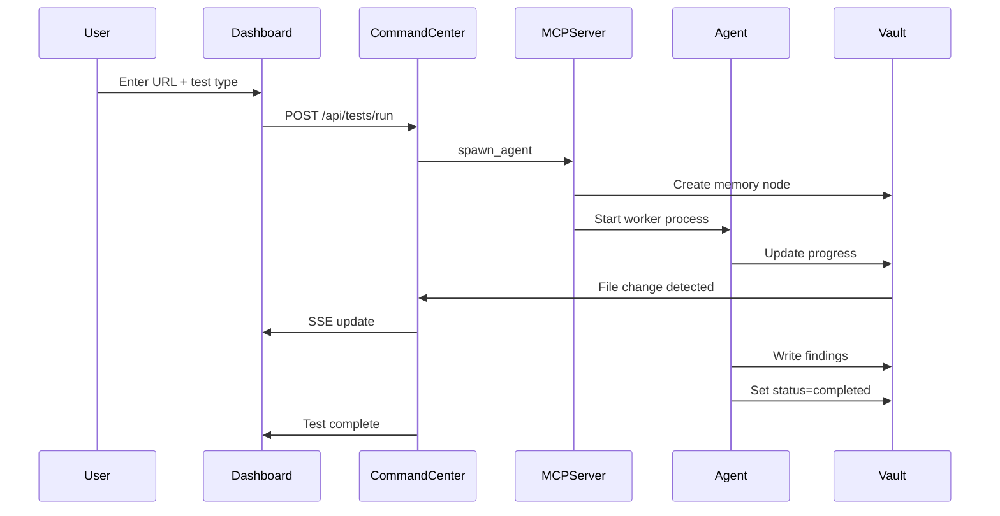

# Quickstart Guide

Get your first test running in under 5 minutes.

## Step 1: Start the Services

```bash
docker compose up --build
```

Wait for all three services to start (you'll see "Mission Control online" in the logs).

## Step 2: Open the Dashboard

Navigate to `http://localhost:3000` in your browser.

You'll see the **Mission Control** dashboard with:
- Orbital visualization in the header
- Live agent count
- Test launcher form
- Real-time metrics

## Step 3: Launch Your First Test

### Method A: Traditional Form

1. In the **Launch Test** panel, enter a URL:
   ```
   https://example.com
   ```

2. Select **Test Type**: `Homepage`

3. Click **▶ Initiate**

### Method B: Chat with Vectra (Recommended)

1. Click the 🤖 **Vectra** chat widget (bottom-right corner)
2. Type:
   ```
   Test the homepage of https://example.com
   ```
3. Vectra will confirm the plan — click **✓ Run**

## Step 4: Monitor Progress

Watch the dashboard update in real-time:
- Agent appears in the **Active Agents** grid
- Progress bar fills as tests run
- Console log shows live output
- Terminal panel streams events

## Step 5: View Results

When the test completes:
1. The agent card turns green (pass) or red (fail)
2. Click **View Result** to see detailed findings
3. Or ask Vectra: "What did the last test find?"

## What Happens Behind the Scenes?



## Next Steps

- Learn to [write custom test scenarios](user-guide/writing-tests.md)
- Explore the [architecture](architecture/overview.md) to understand agents
- Configure [multiple LLM providers](getting-started/configuration.md)
- Set up [CI/CD integration](user-guide/advanced-usage.md)

## Common Commands

```bash
# View agent logs
docker logs vectra-mcp-server

# Restart a service
docker compose restart command-center

# Stop all services
docker compose down

# Clean restart
docker compose down -v && docker compose up --build
```