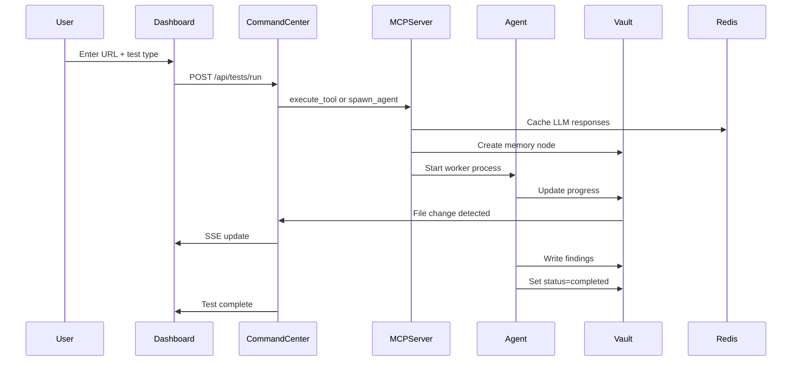

# Quickstart Guide

Get your first test running in under 5 minutes.

## Step 1: Start the Services

```bash
docker compose up --build
```

Wait for all services to start (you'll see health checks passing in the logs):
- `mcp-server` on port 8080
- `command-center` on port 3000
- `redis` on port 6379
- `worker-pool` ready for distributed tasks

## Step 2: Open the Dashboard

Navigate to `http://localhost:3000` in your browser.

You'll see the **Mission Control** dashboard with:
- Live agent count and status
- Test launcher form
- Real-time metrics via Server-Sent Events
- Chat widget for conversational test configuration

## Step 3: Launch Your First Test

### Method A: Direct Feature Test (Fastest)

Test specific features without spawning agents:

```python
from mcp_server.tools import execute_tool

# Test performance
result = execute_tool("test_performance", {
    "url": "https://example.com",
    "thresholds": {"lcp_ms": 2500}
})

print(f"TTFB: {result['metrics']['ttfb_ms']}ms")
print(f"Status: {result['status']}")
```

### Method B: Feature Test via Dashboard

1. In the **Launch Test** panel, enter a URL:
   ```
   https://example.com
   ```

2. Select **Test Type**: 
   - `Performance` — Core Web Vitals
   - `Accessibility` — WCAG compliance
   - `Auth Flow` — Login/logout security
   - `Visual Regression` — Screenshot comparison
   - `API Contract` — Schema validation
   - `Multi-Browser` — Cross-browser smoke test

3. Click **▶ Initiate**

### Method C: Chat with Vectra (Recommended for Complex Tests)

1. Click the 🤖 **Vectra** chat widget (bottom-right corner)
2. Type:
   ```
   Test the homepage of https://example.com for performance and accessibility
   ```
3. Vectra will confirm the plan — click **✓ Run**

### Method D: Spawn an Agent (Full Exploration)

For comprehensive testing with AI-driven exploration:

```python
result = execute_tool("spawn_agent", {
    "role": "ui_explorer",
    "objective": "Explore https://example.com and test all interactive elements",
    "memory_node": "Runs/Full_Exploration.md"
})
```

## Step 4: Monitor Progress

Watch the dashboard update in real-time:
- Agent appears in the **Active Agents** grid
- Progress bar fills as tests run
- Console log shows live output
- Terminal panel streams events

## Step 5: View Results

When the test completes:
1. The agent card turns green (pass), yellow (warning), or red (fail)
2. Click **View Result** to see detailed findings
3. Or ask Vectra: "What did the last test find?"

### Results Structure

All feature tests return a standardized result:

```json
{
  "status": "pass|warning|fail",
  "findings": [
    {
      "title": "Slow TTFB",
      "description": "Time to First Byte: 850ms (threshold: 600ms)",
      "severity": "high"
    }
  ],
  "metrics": {
    "ttfb_ms": 850,
    "fcp_ms": 1200,
    "lcp_ms": 2400
  },
  "duration_seconds": 5.2,
  "timestamp": "2026-06-01T12:00:00Z"
}
```

## What Happens Behind the Scenes?



## Quick Examples

### Authentication Test

```python
result = execute_tool("test_auth_flow", {
    "login_url": "https://example.com/login",
    "username": "test@example.com",
    "password": "password123",
    "logout_url": "https://example.com/logout"
})
```

### Accessibility Test

```python
result = execute_tool("test_accessibility", {
    "url": "https://example.com",
    "standard": "wcag2aa"
})
```

### Visual Regression Test

```python
result = execute_tool("test_visual_regression", {
    "url": "https://example.com",
    "name": "homepage"
})
```

## Next Steps

- Learn to [write custom test scenarios](../user-guide/writing-tests.md)
- Explore [feature testing capabilities](../user-guide/feature-testing.md)
- Understand the [architecture](../architecture/overview.md)
- Configure [multiple LLM providers](configuration.md)
- Set up [CI/CD integration](../user-guide/advanced-usage.md)

## Common Commands

```bash
# View agent logs
docker logs vectra-mcp-server

# View worker pool logs
docker logs vectra-worker-pool

# Scale worker pool (more parallel agents)
docker compose up -d --scale worker-pool=3

# Restart a service
docker compose restart command-center

# Stop all services
docker compose down

# Clean restart (removes volumes)
docker compose down -v && docker compose up --build

# Run tests inside container
docker compose exec mcp-server pytest tests/ -v
```
