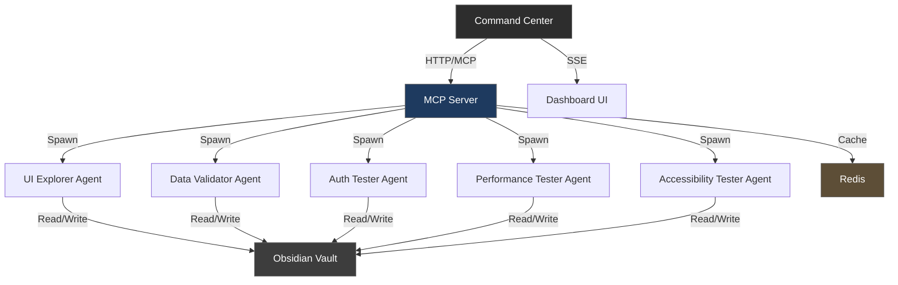

# Vectra QA Documentation

Welcome to the Vectra QA documentation. Vectra QA is a production-ready, multi-agent autonomous testing framework that deploys specialized AI agents to explore, test, and validate web applications.

## What is Vectra QA?

Traditional E2E testing relies on static scripts and brittle selectors. Vectra QA treats testing as an autonomous exploration problem:

- **🤖 Dynamic Agent Spawning**: Orchestrator instantiates specialized agents on-demand
- **🧠 LLM-Driven Agents**: Full LLM reasoning for every decision — no keyword matching
- **🔐 Security Testing**: Auth flow validation, session cookie security, HTTPS enforcement
- **📊 Performance Monitoring**: Core Web Vitals, Lighthouse CI integration
- **🎨 Visual Regression**: Screenshot comparison with baseline management
- **🔌 API Contract Validation**: OpenAPI schema verification
- **♿ Accessibility Testing**: axe-core with WCAG compliance
- **🌐 Cross-Browser Testing**: Chromium, Firefox, WebKit smoke tests
- **⚡ LLM Response Caching**: SHA256-based cache reduces API costs by 60-80%
- **📡 Distributed Workers**: Redis-backed task queue for horizontal scaling
- **🎛️ Live Command Center**: Dark-mode dashboard with Server-Sent Events
- **🧠 Obsidian Memory Layer**: Agents read/write Markdown with YAML frontmatter

## Quick Links

- **[Getting Started](getting-started/installation.md)** — Install and configure Vectra QA
- **[Quickstart](getting-started/quickstart.md)** — Run your first test in 5 minutes
- **[Architecture](architecture/overview.md)** — Understand how agents communicate and share memory
- **[API Reference](api/endpoints.md)** — REST API documentation for all endpoints
- **[User Guide](user-guide/writing-tests.md)** — Learn to write effective test scenarios
- **[Feature Testing](user-guide/feature-testing.md)** — Auth, performance, accessibility, and more

## Agent Roles

Vectra QA supports 8 specialized agent roles:

| Role | Description | Use Case |
|------|-------------|----------|
| **UI Explorer** | LLM-driven browser automation | Complex UI flows, exploration |
| **Data Validator** | Network traffic validation | API response verification |
| **Auth Tester** | Authentication flow testing | Login/logout security |
| **Visual Regression** | Screenshot comparison | UI consistency checks |
| **Performance Tester** | Core Web Vitals measurement | Page speed monitoring |
| **API Contract Tester** | OpenAPI schema validation | API contract compliance |
| **Accessibility Tester** | WCAG compliance checks | Accessibility auditing |
| **Multi-Browser Tester** | Cross-browser smoke tests | Browser compatibility |

## System Architecture

## Test Coverage

Vectra QA has **79 unit tests** covering all major components:

- ✅ Vault operations (file I/O, concurrency, path security)
- ✅ Agent spawning and lifecycle management
- ✅ Browser automation (Playwright)
- ✅ MCP tools (DOM query, interaction, network interception)
- ✅ Feature modules (auth, visual regression, performance, API, accessibility, multi-browser)
- ✅ LLM routing and caching
- ✅ Orchestrator planning and execution
- ✅ Pydantic input validation

## Getting Help

- 📖 [Full Documentation](https://vectra-qa.artflarex.com)
- 🐛 [Report Issues](https://github.com/Artflarex-Limited/vectra-qa/issues)
- 💬 [GitHub Discussions](https://github.com/Artflarex-Limited/vectra-qa/discussions)
- 📜 [Changelog](https://github.com/Artflarex-Limited/vectra-qa/blob/main/CHANGELOG.md)
- 📊 [Test Report](https://github.com/Artflarex-Limited/vectra-qa/blob/main/TEST_REPORT.md)

## License

Vectra QA is released under the [MIT License](https://github.com/Artflarex-Limited/vectra-qa/blob/main/LICENSE).
