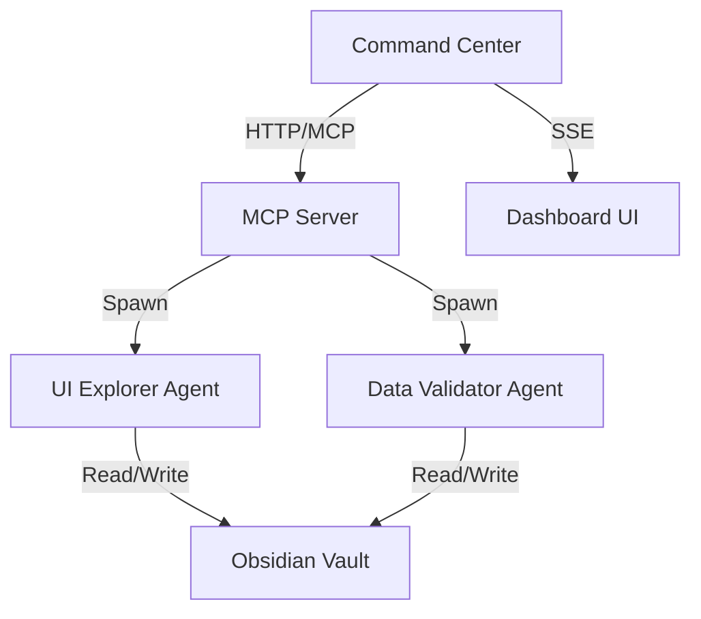

# Vectra QA Documentation

Welcome to the Vectra QA documentation. Vectra QA is a multi-agent autonomous testing framework that deploys specialized AI agents to explore, test, and validate web applications.

## What is Vectra QA?

Traditional E2E testing relies on static scripts and brittle selectors. Vectra QA treats testing as an autonomous exploration problem:

- **🤖 Dynamic Agent Spawning**: Orchestrator instantiates UI Explorers and Data Validators on-demand
- **🧠 Obsidian Memory Layer**: Agents read/write Markdown files with YAML frontmatter for structured state tracking
- **📡 Live Command Center**: Dark-mode dashboard with Server-Sent Events for real-time monitoring
- **💬 Natural Language Interface**: Chat with Vectra to configure and run tests conversationally

## Quick Links

- **[Getting Started](getting-started/installation.md)** — Install and configure Vectra QA
- **[Quickstart](getting-started/quickstart.md)** — Run your first test in 5 minutes
- **[Architecture](architecture/overview.md)** — Understand how agents communicate and share memory
- **[API Reference](api/endpoints.md)** — REST API documentation for all endpoints
- **[User Guide](user-guide/writing-tests.md)** — Learn to write effective test scenarios

## Test Types

Vectra QA supports multiple test types, each handled by specialized agents:

| Test Type | Agent | Description |
|-----------|-------|-------------|
| **Homepage** | UI Explorer | Page structure, navigation, CTAs, footer, console errors |
| **Navigation** | UI Explorer | Link validation, page transitions, mobile menu |
| **Contact Form** | UI Explorer | Form fields, validation, accessibility |
| **API Monitoring** | Data Validator | Backend API calls, response validation |
| **Accessibility** | UI Explorer | WCAG compliance, ARIA, keyboard navigation, alt text |
| **Responsive Design** | UI Explorer | Multi-viewport testing (desktop, tablet, mobile) |
| **Full Suite** | UI Explorer | Complete audit — all test types combined |

## System Architecture

## Getting Help

- 📖 [Full Documentation](https://vectra-qa.artflarex.com)
- 🐛 [Report Issues](https://github.com/Artflarex-Limited/vectra-qa/issues)
- 💬 [GitHub Discussions](https://github.com/Artflarex-Limited/vectra-qa/discussions)
- 📜 [Changelog](https://github.com/Artflarex-Limited/vectra-qa/blob/main/CHANGELOG.md)

## License

Vectra QA is released under the [MIT License](https://github.com/Artflarex-Limited/vectra-qa/blob/main/LICENSE).